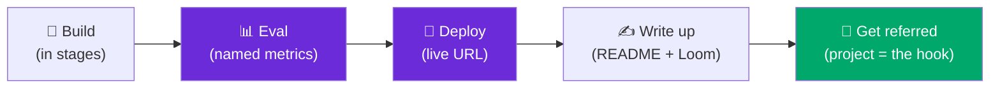

**12 deep, buildable AI/LLM portfolio projects that actually get people hired in 2026** — each a full brief with milestones, evals, and a deploy path.

*Maintained by [Landed](https://landed.jobs) — daily AI-native job matches, agent help with every application, and mock-interview prep.*

---

**The single highest-leverage thing for breaking into AI roles is a portfolio of *shipped, measured* projects.** But quantity is a trap: **one production project with proper evals beats five tutorial notebooks.** This repo is the curated **12** — each a deep brief you can actually build, with the two layers everyone else skips: an **eval report** and a **live deployment.** That's the difference between "GPT wrapper" and "hire this person."

> ⭐ **Star this repo** — it's the quality-over-quantity companion to the broad [60+ catalog](https://github.com/landedjobs/ai-engineer-portfolio-projects). Pick one, ship it, and use it as your referral conversation-starter.

### What makes a project *job-winning* in 2026

A reviewer spends **~90 seconds** on your repo. In those seconds they scan for four signals:

| ✅ The signal that wins | ❌ The red flag that loses |
|------------------------|---------------------------|
| **README as a product spec** (problem, arch diagram, results) | 100 toy notebooks, no through-line |
| **An eval report** (named metrics + numbers + a target) | "it works well" — no evals, just vibes |
| **A live deployment URL** (reviewers don't clone) | runs only on your laptop, 12 undocumented steps |
| **Cost & latency** ($/1k tok, p50/p95) | benchmark claims with no numbers |

Build **3–4** of these deeply — not 15 shallowly — and present them per the [presentation checklist](presentation-checklist.md).

---

## The 12 projects that actually land AI jobs in 2026

> Difficulty: 🟢 beginner · 🟡 intermediate · 🔴 advanced. Every brief includes **Problem · Who it impresses · Skills · Stack · Milestones · Evals · Deploy · Stretch · Reference resources.**

| # | Project | Skills it proves | Difficulty | Core stack | Brief |
|---|---------|------------------|:----------:|------------|-------|
| 1 | **Chat with your docs (production RAG)** | hybrid retrieval, reranking, citations, RAG evals, observability | 🔴 | LlamaIndex · pgvector · BM25 · reranker · RAGAS · Langfuse | [→](projects/chat-with-your-docs-rag.md) |
| 2 | **Agentic workflow** | tool design, orchestration, recovery, trajectory eval | 🔴 | LangGraph · tools · Langfuse | [→](projects/agentic-workflow.md) |
| 3 | **Production eval suite** | golden sets, LLM-judge calibration, eval-gated CI | 🟡 | RAGAS · Phoenix · GitHub Actions | [→](projects/production-eval-suite.md) |
| 4 | **MCP "second brain" server** | MCP, tool design, trust-boundary security | 🔴 | MCP SDK · pgvector · Claude Desktop | [→](projects/mcp-second-brain.md) |
| 5 | **Real-time voice agent** | streaming, STT/TTS, latency engineering | 🔴 | Pipecat/LiveKit · Deepgram · ElevenLabs | [→](projects/realtime-voice-agent.md) |
| 6 | **Structured extraction pipeline** | structured output, schema design, validation/repair | 🟡 | Instructor/Outlines · Pydantic · Postgres | [→](projects/structured-extraction-pipeline.md) |
| 7 | **Fine-tuned specialist model** | dataset curation, LoRA/QLoRA, eval vs base | 🔴 | Unsloth · PEFT · vLLM | [→](projects/fine-tuned-specialist-model.md) |
| 8 | **LLM from scratch** | tokenization, attention, pretraining internals | 🔴 | PyTorch · nanoGPT · minbpe | [→](projects/llm-from-scratch.md) |
| 9 | **Semantic + hybrid search engine** | ANN, BM25, RRF fusion, reranking, IR evals | 🟡 | Qdrant · bge · reranker · FastAPI | [→](projects/semantic-search-engine.md) |
| 10 | **Guardrails & moderation** | injection defense, PII, red-teaming | 🟡 | Guardrails-AI · Presidio · garak | [→](projects/guardrails-moderation.md) |
| 11 | **Multimodal document AI** | vision LLMs, multimodal RAG, chart/table QA | 🟡 | ColPali · VLM · docling · Instructor | [→](projects/multimodal-doc-ai.md) |
| 12 | **LLMOps cost & latency dashboard** | tracing, cost attribution, caching, alerting | 🟡 | Langfuse · OpenTelemetry · Redis | [→](projects/llmops-cost-dashboard.md) |
| ＋ | **GTM / AI-PM copilot** *(bonus)* | applied AI, business value, real users | 🟡 | Next.js · Vercel AI SDK · Postgres | [→](projects/gtm-ai-copilot.md) |

> [!TIP]
> **Not sure which to pick?** For **AI/RAG Engineer** loops, build #1 + #3. For **AI Agent Engineer**, #2 + #4. For **LLM Engineer / Applied Scientist**, #7 + #8. For **AI Product Engineer / GTM**, the bonus copilot + #6. See the [FAQ](#faq).

## Contents

- [What makes a project job-winning](#what-makes-a-project-job-winning-in-2026)
- [The 12 projects (table)](#the-12-projects-that-actually-land-ai-jobs-in-2026)
- [Project teasers](#project-teasers) — one paragraph each
- [How to present your project](#how-to-present-your-project) — the polish checklist
- [What's new (2026-07)](#whats-new-2026-07)
- [FAQ](#faq)
- [Contributing](#contributing)
- [The Landed family](#the-landed-ai-native-jobs-family)

---

## Project teasers

**1. [Chat with your docs — production RAG](projects/chat-with-your-docs-rag.md)** 🔴
The flagship. Make an LLM answer questions about a real corpus *with clickable citations*, and *prove* the answers are grounded. You win by doing what tutorials skip: hybrid (dense + BM25) retrieval, a reranker, a "not in the docs" refusal, and a **real eval table** (recall@20, faithfulness, cost). The single most-cited must-have for RAG loops.

**2. [Agentic workflow](projects/agentic-workflow.md)** 🔴
An agent that plans, calls ≥3 tools, *recovers from failure*, and finishes a real task — with a **trajectory eval** and pass^k reliability. The differentiator is retry budgets, structured tool errors, and a real verifier, not "the LLM called a function."

**3. [Production eval suite](projects/production-eval-suite.md)** 🟡
The project that says "senior" because almost nobody builds it. A golden set from error analysis, a **calibrated** LLM-judge (Cohen's κ vs humans), an A/B test with significance, and a **CI gate that fails a PR on regression.** Directly answers "how do you know it works?"

**4. [MCP "second brain" server](projects/mcp-second-brain.md)** 🔴
Expose your notes/data as a **Model Context Protocol** server any AI client can use. Proves you understand tools *as a trust boundary* — tool-poisoning defense, version pinning, least-privilege — which is right at the 2026 frontier.

**5. [Real-time voice agent](projects/realtime-voice-agent.md)** 🔴
A voice agent you can *talk to*: STT → LLM+tools → TTS, streaming, sub-second turn-taking and barge-in. The most impressive live demo in the repo, and it proves you can wrangle **latency and streaming** end to end.

**6. [Structured extraction pipeline](projects/structured-extraction-pipeline.md)** 🟡
Turn messy invoices/resumes/receipts into **validated, schema-locked JSON** with confidence, validation, and repair. The pragmatic anti-hallucination flex that looks like real production work — because it is.

**7. [Fine-tuned specialist model](projects/fine-tuned-specialist-model.md)** 🔴
LoRA/QLoRA-tune a small model to **beat a frontier API on one narrow task** — cheaper and faster — and *prove it head-to-head.* The clearest "I can train, not just call APIs" signal for LLM-engineering loops.

**8. [LLM from scratch](projects/llm-from-scratch.md)** 🔴
Build a GPT — BPE tokenizer, attention, training loop — from first principles, then reproduce a small model. Makes every transformers-internals interview question trivial. A knowledge signal for LLM Engineer / Applied Scientist loops.

**9. [Semantic + hybrid search engine](projects/semantic-search-engine.md)** 🟡
RAG's retrieval half, isolated and done right: dense + BM25, RRF fusion, reranking, and a **baseline-comparison table** (recall@k, MRR, nDCG). The purest proof of the most in-demand RAG skill.

**10. [Guardrails & moderation](projects/guardrails-moderation.md)** 🟡
Wrap an LLM app in a safety layer — injection defense, PII redaction, jailbreak resistance — and **red-team your own defenses** with an attack-success-rate table. Safety maturity is rare in portfolios and disproportionately valued.

**11. [Multimodal document AI](projects/multimodal-doc-ai.md)** 🟡
An app that *sees*: answer questions from charts, tables, and scanned PDFs a vision LLM, with ColPali-style multimodal retrieval. The winning demo is a question whose answer is *only in an image* — text-only RAG returns nothing; yours nails it.

**12. [LLMOps cost & latency dashboard](projects/llmops-cost-dashboard.md)** 🟡
Trace every LLM call — tokens, p50/p95 latency, cost, cache hits — in a dashboard with alerts, then use it to cut cost/latency and show the before/after. The production-mindset signal that separates "I built a demo" from "I run this."

**＋. [GTM / AI-PM copilot](projects/gtm-ai-copilot.md)** 🟡 *(bonus)*
A business-facing build — lead enrichment + scoring + personalized outbound, ticket triage, or a 0→1 micro-app with **10 real users**. Under-represented in portfolios, which makes it a differentiator for AI Product Engineer and GTM loops.

---

## How to present your project

The build is half the work; presentation is the other half — and it's the half most people skip. The full guide is in **[presentation-checklist.md](presentation-checklist.md)**. The short version:

- **README as a product spec** — problem, a 90-sec demo GIF, an architecture diagram, a results table, "run it" in one command, "what I'd do next."
- **Live URL** — Vercel / Modal / Railway / HF Spaces. Put it at the top. Reviewers don't clone.
- **Eval report** — an `evals/` folder, 3+ metrics with numbers and a target, a before/after, and a *calibrated* judge (say the κ).
- **Cost & latency** — $/1k tokens, p50/p95, and the one thing you did to cut them.
- **A writeup / Loom** on the key tradeoff — this is the artifact you drop into a referral message.
- **Pin max 6 repos** on your GitHub profile. Curation *is* a signal.
- **Rehearse** the 90-second walkthrough and "how do you know it works?"

> [!WARNING]
> The fastest way to *lose* a loop with a good project is to not be able to explain your own eval. Build the eval you can defend — a copied RAGAS notebook you can't explain works *against* you.

---

## What's new (2026-07)

- **2026-07** — Initial release: **12 curated deep briefs** (+1 GTM/AI-PM bonus), the [presentation checklist](presentation-checklist.md), and the contributor quality spec.
- **Dated for 2026** — reflects the current signal set: *eval is the new system design*, MCP as the interop standard, agentic + trajectory eval, contextual retrieval, LoRA/QLoRA, real-time voice, cost/latency observability as table stakes.
- **Cross-linked** the broad [60+ catalog sibling](https://github.com/landedjobs/ai-engineer-portfolio-projects) throughout — this repo is the *curated* companion.

---

## FAQ

**How many projects do I need to land an AI job?**
**Three to four — built deeply, with evals and a live URL — not fifteen shallow ones.** One production RAG project with a proper eval report beats five tutorial notebooks. Reviewers scan for depth and production signals in ~90 seconds; a curated, well-presented few wins. Pick from the [table](#the-12-projects-that-actually-land-ai-jobs-in-2026), and present them per the [checklist](presentation-checklist.md).

**What makes an AI project impressive in 2026?**
Four signals, in order: (1) a **README that reads like a product spec**, (2) an **eval report** with named metrics and numbers, (3) a **live deployment URL**, and (4) **cost & latency** figures. Bonus: observability, error handling (retry/backoff/cost caps), and quantitative before/after results. The red flags are the inverse — no evals ("just vibes"), no deploy, benchmark claims without numbers, and copy-pasted Streamlit demos.

**Do I need to deploy it?**
**Yes — a live, clickable URL is one of the most-cited must-haves**, because reviewers won't clone your repo. Use Vercel, Modal, Railway, or HF Spaces, ship a `.env.example` + Dockerfile, and put a rate-limit + cost-cap on the public URL. If the model must stay private, ship a recorded demo *plus* a one-command local run — never make the reviewer fight your setup.

**RAG vs agent vs fine-tuning project — which should I build?**
Match it to the role. **AI / RAG Engineer** → [production RAG](projects/chat-with-your-docs-rag.md) + an [eval suite](projects/production-eval-suite.md). **AI Agent Engineer** → [agentic workflow](projects/agentic-workflow.md) + [MCP server](projects/mcp-second-brain.md). **LLM Engineer / Applied Scientist** → [fine-tune](projects/fine-tuned-specialist-model.md) + [LLM from scratch](projects/llm-from-scratch.md). **AI Product Engineer / GTM** → the [copilot](projects/gtm-ai-copilot.md) + [structured extraction](projects/structured-extraction-pipeline.md). If in doubt, build the **[production RAG with evals](projects/chat-with-your-docs-rag.md)** — it's the highest-signal flagship across the most roles.

**Do I need an ML PhD or to train models from scratch?**
No. Most AI Engineer / AI Product Engineer roles want people who **ship** with LLMs (RAG, agents, evals) — not researchers. [LLM-from-scratch](projects/llm-from-scratch.md) and [fine-tuning](projects/fine-tuned-specialist-model.md) are edges for LLM-Engineer / research-adjacent loops specifically; for most jobs, a deeply-evaled RAG or agent project wins.

**Where do I get more project ideas?**
This repo is the *curated 12*. For a broad menu — **60+ projects across RAG, agents, evals, fine-tuning, multimodal, serving, and GTM** — see the sibling [`ai-engineer-portfolio-projects`](https://github.com/landedjobs/ai-engineer-portfolio-projects).

---

## Contributing

PRs and issues welcome — but this is a *curated* repo, so every brief clears a quality bar (it must prove a distinct skill and ship with evals + a deploy path). See [CONTRIBUTING.md](CONTRIBUTING.md) and use the [Suggest a project](.github/ISSUE_TEMPLATE/suggest-a-project.md) issue template.

---

## The Landed AI-native jobs family

Part of the [Landed](https://landed.jobs) AI-native job-search family:

- 🧭 [awesome-ai-native-jobs](https://github.com/landedjobs/awesome-ai-native-jobs) — the umbrella that maps the whole AI-native job landscape
- 🔥 [whos-hiring-in-ai](https://github.com/landedjobs/whos-hiring-in-ai) — real hiring posts from founders on X, sorted by role
- 💸 [recently-funded-ai-startups-hiring](https://github.com/landedjobs/recently-funded-ai-startups-hiring) — fresh-capital startups staffing up now
- 🚀 [ai-engineer-jobs](https://github.com/landedjobs/ai-engineer-jobs) — 300 live AI engineer roles, auto-updated
- 🤝 [forward-deployed-engineer-jobs](https://github.com/landedjobs/forward-deployed-engineer-jobs) — FDE & customer-facing engineering
- 📈 [gtm-engineer-jobs](https://github.com/landedjobs/gtm-engineer-jobs) — GTM engineering roles
- 🎓 [ai-fellowships-and-residencies](https://github.com/landedjobs/ai-fellowships-and-residencies) — 75 fellowships, residencies & programs
- 📘 [ai-interview-guides](https://github.com/landedjobs/ai-interview-guides) — 33 company interview guides
- ❓ [ai-interview-questions](https://github.com/landedjobs/ai-interview-questions) — 331 real interview questions with answers
- 🗺️ [ai-product-engineer-roadmap](https://github.com/landedjobs/ai-product-engineer-roadmap) — the AI product engineer roadmap
- 📦 [ai-engineer-portfolio-projects](https://github.com/landedjobs/ai-engineer-portfolio-projects) — 80+ buildable portfolio projects

---

### Stop spraying. Get **matched**, get **prepped**, get **Landed**.

Maintained by [Landed](https://landed.jobs) · No affiliation with the companies or repos named. Content MIT-licensed.

 

